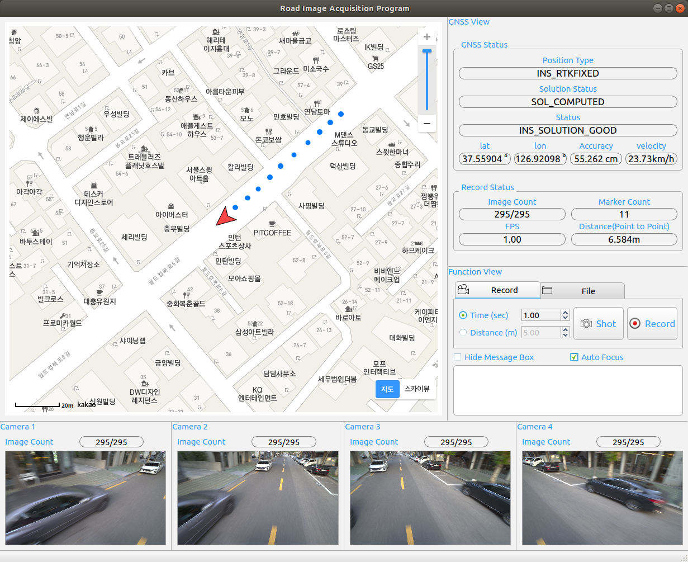
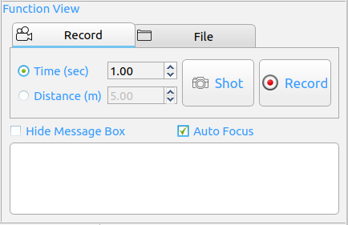

Road Image Acquistion Program
===============

Overview
--------

Based on ROS melodic and QT C++

- Camera : Basler ace acA4112-8gc 
- GNSS :  Novatel PWRPAK7

--------

### Parameter Setting

1. **novatel_gps_driver**

   Link : <https://github.com/swri-robotics/novatel_gps_driver>

   setting .launch file

   - road_recorder/launch/sensor.launch 

   ```java
   <?xml version="1.0"?>
   <launch>
     <node name="novatel"
           pkg="nodelet" type="nodelet"
           args="standalone novatel_gps_driver/novatel_gps_nodelet">
       <rosparam>
         verbose: true
         connection_type: tcp
         device: 192.168.1.210:3005
         imu_sample_rate: -1
         polling_period: 0.2
         use_binary_messages: true
         publish_novatel_positions: true
         publish_novatel_utm_positions: true
         publish_imu_messages: true
         imu_frame_id: /imu
         publish_nmea_messages: true
         frame_id: /gps
       </rosparam>
     </node>
   </launch>
   ```

2. **basler_ros_driver**

   setting number of cameras & serial number 

   - basler_ros_driver/config/default.yaml 

   ```yaml
   camera_count : 4
   
   camera1:
       name: cam1
       serial_number: 40097766
   
   camera2:
       name: cam2
       serial_number: 40097767
   
   camera3:
       name: cam3
       serial_number: 40097977
   
   camera4:
       name: cam4
       serial_number: 40097973
   ```

3. **road_recorder**

   setting number of cameras & mode 

   - road_recorder/config/default.yaml 

   ```yaml
   # camera mode false --> simulation / true --> real world
   
   viewer_mode: false
   camera_count: 4
   ```

      - `viewer_mode` : program mode     

        | value |      mode       |
        | :---: | :-------------: |
        | true  |   record mode   |
        | false | simulation mode |

     - `camera_count` : number of connected cameras

4. **Kakao Map API**

   Get JavaScript API key from https://developers.kakao.com/ 

   - road_recorder/resources/map/map.html

     - Delete the comment `<!-- Register JavaScript app key -->` Enter the issued key

     ```javascript
     <!DOCTYPE html>
     <html style="height:98%;">
         <head>
             <meta charset="utf-8"/>
             <meta http-equiv="X-UA-Compatible" content="IE=edge">
             <meta name="viewport" content="width=device-width, initial-scale=1.0, maximum-scale=1.0, minimum-scale=1.0, user-scalable=no">
             <title>Qt map</title>
             <script type="text/javascript" src="http://dapi.kakao.com/v2/maps/sdk.js?appkey=<!-- Register JavaScript app key -->&callback"></script>
             <script src="http://code.jquery.com/jquery-latest.js"></script>
         </head>
         <style>
             .wrap {left: 18px; bottom: 18px; width: 36px;height: 36px;}
         </style>
         <body style="height:100%;">
             <div id="map" style="width:100%; height:100% ;border:0px solid black;"></div>
         </body>
     </html>
     ```


--------

### .launch execution

- run **road_recorder**

```bash
roslaunch road_rocorder run.launch
```

- run **novaltel_gps_driver** and **basler_ros_driver**

```bash
roslaunch road_recorder sensor.launch
```

--------

### Topic & Service Configuration

   

|     Node Name      |      Topic & Service      |          Description           |
| :----------------: | :-----------------------: | :----------------------------: |
| basler-ros-driver  |    Camera info (Topic)    |    camera information data     |
| basler-ros-driver  |     Raw Image (Topic)     |       camera image data        |
|   road_recorder    |    Camera info (Topic)    |       camera image data        |
|   road_recorder    | Image Directory (Service) | Specify .bmp file storage path |
|   road_recorder    |  Bag Directory (Service)  | Specify .bag file storage path |
|   road_recorder    |  Start & Stop (Service)   |   bag recorder start & stop    |
| novatel-gps-driver |      bestpos (Topic)      | Latitude, Longitude, Accuracy  |
| novatel-gps-driver |      bestutm (Topic)      | UTM Coordinate System x, y, z  |
| novatel-gps-driver |      Inspva (Topic)       |        Roll, Pitch, Yaw        |

--------

  ### GUI 구성

   

 - **Map View**

   Display map based on KaKao Map API / Display interpolated coordiates and current location on map

 - **Camera View**

   Display camera image

 - **Fucntion View**

   Setting camera's recording and stopping and file storage location / Select the recording condition (distance, time) and its value

    - **Record**

      - Click record button to start recording

      - Click shot button to record point at which it was pressed is taken

      - Select button group to choose mode

        |   Mode   |       Discription       |
        | :------: | :---------------------: |
        |   Time   |   Record base on time   |
        | Distance | Record base on distance |

         

    - **Directory** 

      - Specify name and path of folder(bag, csv, image) to be saved
      
         

 - **GNSS View**

   Display coordiate data and status received from GNSS PWRPAK7 
